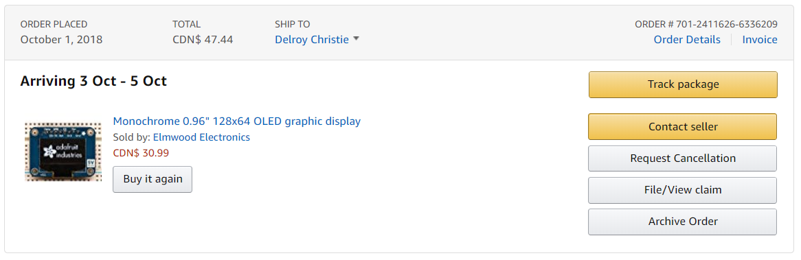
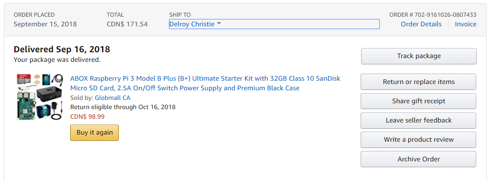

SSD1306_OLED_Sensor
===============

### November 20th, 2018 (Week 12)

Today the enclosure for the Broadcom development platform is due, as outlined in my [project schedule](https://github.com/dchristie75/SSD1306-Monochrome-OLED/blob/master/Documentation/Project_Schedule.mpp). After acquiring the CorelDraw design files, I worked hard to edit these files to suite my project design. [Here](https://github.com/dchristie75/SSD1306-Monochrome-OLED/blob/master/Documentation/Pi2Case.cdr) is the edited file to suite my Broadcom development platform and stackable header with sensor. I am satisfied with the finished product as the enclosure is tall enough to house my sensor while provoding enough protection. [Here](https://github.com/dchristie75/SSD1306-Monochrome-OLED/blob/master/Index_src/PiCase.jpg) is a view of the finish product.

As I complete this milestone, I am pleased to report that the project remains on track. My [financial status](https://github.com/dchristie75/SSD1306-Monochrome-OLED/blob/master/Documentation/Hardware_Production_Budget.xlsx) remains unchanged as the acrylic material for the case and the laser cutting was done through to the prototype lab.

### November 13th, 2018 (Week 11)

As outlined in my [project schedule](https://github.com/dchristie75/SSD1306-Monochrome-OLED/blob/master/Documentation/Project_Schedule.mpp) today is the power-up demonstration milestone. This week I was busy trying to configure my SSD1306 OLED monochrome display for text and image display. I ran into a few challenges in relation to the I2C interface—the interface we are required to use for this project. The problem is: the default address of the hardware was different from the one referencing by all the Python libraries. This was a challenge because no communication can occur without the correct address being configured. Hence, great effort went into figuring out how to configure the address to be compatible with the Python libraries, along with all the other dependencies. After resolving that issue, communication was established but only random dots were being displayed. Again to resolve the issue, I consulted many [online]( https://www.raspberrypi-spy.co.uk/2018/04/i2c-oled-display-module-with-raspberry-pi/#comment-227572) [references]( http://hallard.me/adafruit-ssd1306-oled-display-driver-for-raspberry-pi/) and [forums](https://forums.adafruit.com/viewtopic.php?f=57&t=132871&p=659887&hilit=ssd1306+OLED+raspberry+pi#p659887). On Nov. 12 however, I finally figured out that for this OLED display model, the RST line must be connected to the GPIO24 on the Raspberry Pi to work; along with modifying the /etc/modules, /etc/modprobe.d/raspi-blacklist.conf, and the .py files in the examples folder. The necessary wiring adjustment was made to the PCB [Fritzing](https://github.com/dchristie75/SSD1306-Monochrome-OLED/blob/master/Documentation/SSD1306_Wiring_Final.fzz) design and [Gerber](https://github.com/dchristie75/SSD1306-Monochrome-OLED/blob/master/Documentation/SSD1306_Gerber_Files.rar) files sent to the prototype lab for re-printing. Because of the time it took to reprint the PCB, I did not receive it in time for an in-class demonstration with the Raspberry PI. Hence, the demonstration was done with the breadboard. This hardware problem gave me an opportunity to do comprehensive research and collaboration with others to find a solution. With the completion of this milestone, I am within [schedule](https://github.com/dchristie75/SSD1306-Monochrome-OLED/blob/master/Documentation/Project_Schedule.mpp) of the project’s completion. Since a reproduction of the PCB was needed, an additional cost of [$4.90](https://www.seeedstudio.com/fusion.html) was added to the overall budget. Here is an [image](https://github.com/dchristie75/SSD1306-Monochrome-OLED/blob/master/Index_src/20181113_000239.jpg) the preliminary final display setup.

### November 6th, 2018 (Week 10)

As outlined in my [project schedule](https://github.com/dchristie75/SSD1306-Monochrome-OLED/blob/master/Documentation/Project_Schedule.mpp), today is the PCB soldered milestone. With the completion of this milestone, I am within schedule with respect to the project completion. During the past week, I worked on creating the layout for PCB wiring and design in Fritzing. I aim to connect the SSD1306 OLED Monochrome display with the Raspberry Pi, and the sockets to enable this process were incorporated into the PCB design. I found [a site that offered hepful](https://www.raspberrypi-spy.co.uk/2018/04/i2c-oled-display-module-with-raspberry-pi/) information regarding connecting the pins and configuring the I2C interface, along with importing the relevant Python libraries. As outlined in my previous post, there was a problem detecting the address of the SSD1306 display. However, collaboration with Kelly and Vlad from the Prototype Lab helped to resolve the issue. That issue gave me an opportunity to delve deeper into troubleshooting hardware while improving my soldering skills. 

My [Budget](https://github.com/dchristie75/SSD1306-Monochrome-OLED/blob/master/Documentation/Hardware_Production_Budget.xlsx) included headers, but these were not bought with the other products. Therefore, these [headers](https://www.digikey.ca/product-detail/en/sullins-connector-solutions/PPTC081LFBN-RC/S7006-ND/810147) were had from the Prototype Lab with a collective value of [$5.06](https://www.digikey.ca/product-detail/en/adafruit-industries-llc/2223/1528-1385-ND/5629433). My PCB design was done and Gerber files sent to the Protoype Lab for production without any problems. Here is an image of the [final PCB](https://github.com/dchristie75/SSD1306-Monochrome-OLED/blob/master/images/pcb.jpg) with soldered headers connected to the Rapberry pi and the [Fritzing files](https://github.com/dchristie75/SSD1306-Monochrome-OLED/blob/master/Documentation/SSD1306_Wiring_Final.fzz) that they result from. Additional images can be found [here](https://github.com/dchristie75/SSD1306-Monochrome-OLED/tree/master/Index_src).

Week 9 PCB
---------------
This blog entry is to give a progress update on my hardware project. Last week there were some issues detecting the sensor's I2C address. However, after visiting Kelly and Vlad in the prototype lab during the course of the week we managed to find the problem and correct it. So at this time I am on track and within budget of my project. The PCB schema was designed and sent to the prototype lab for etching. I do not need to purchase any further part for the project so no additional cost is added to my original budget. Moving on to the soldering porting of the project next week.

Week 8 Hardware
-------------------
This blog entry is to give an update into my progress on my hardware sensor. At this point in the semester (Week 8), I am on schedule. However, I connected the SSD1306 OLED sensor using I2C connection but it did not work. I tried various times using various appropriate pin connectors but it still didn't work. The professor suggested tried connecting using SPI instead of I2C; or in case that didn't work, tried using an Arduino to see if that works. During the course of this week I will contact Vlad or Kelly at the prototype lab to figure out this problem. So this is a minor, or possibly a major setback in my progress. It will also put me in a negative financial status since I will have to repurchase the OLED sensor in the worst case scenario.

Image of what I have so far:
[Hardware Connection](hardware.png)

Week 7 Pseudocode Submission
-------------------------------

Week 6 
----------

Week 5 Proof of purchase
-------------
### Item(s) to be delivered

### Item(s) already delivered

Week 4
---------------

Created [budget document](Documentation/Hardware_Production_Budget.xlsx)

Week 3
----------------

Created [Project Schedule](Documentation/Project_Schedule.mpp)

Week 2
---------------

Created [Proposal Content](Documentation/Proposal_Content.xlsx)

Created the GitHub repository
